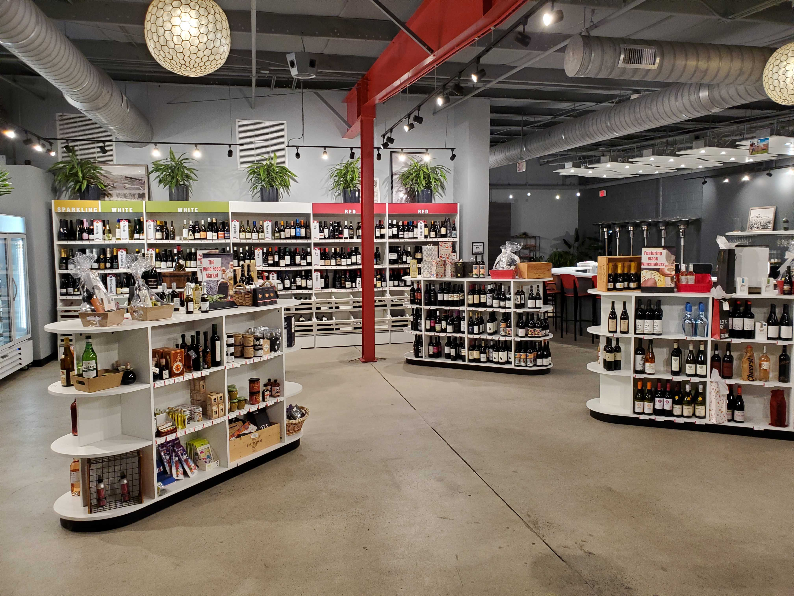
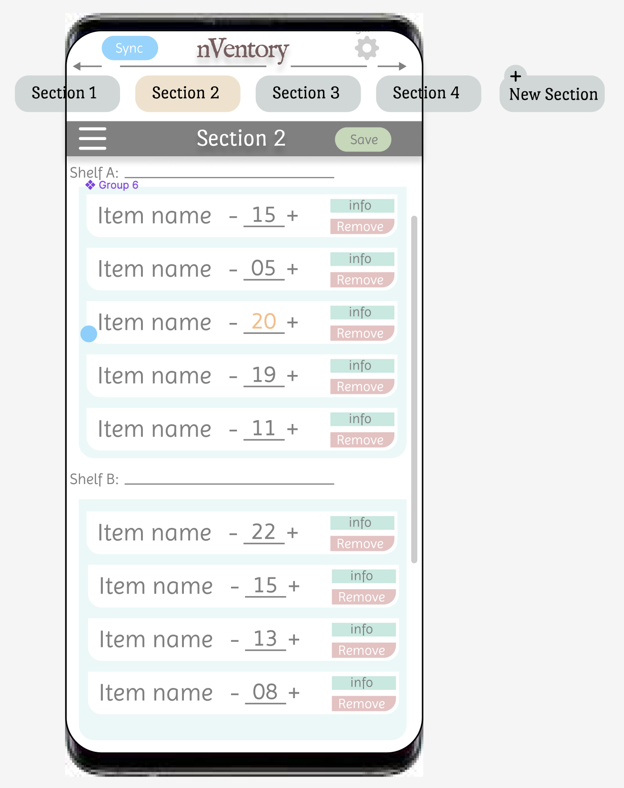
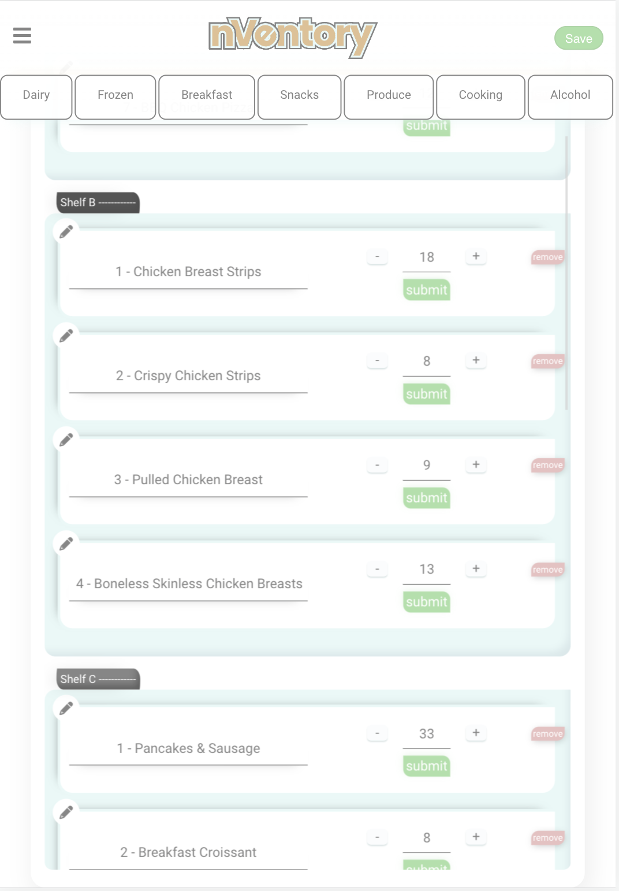
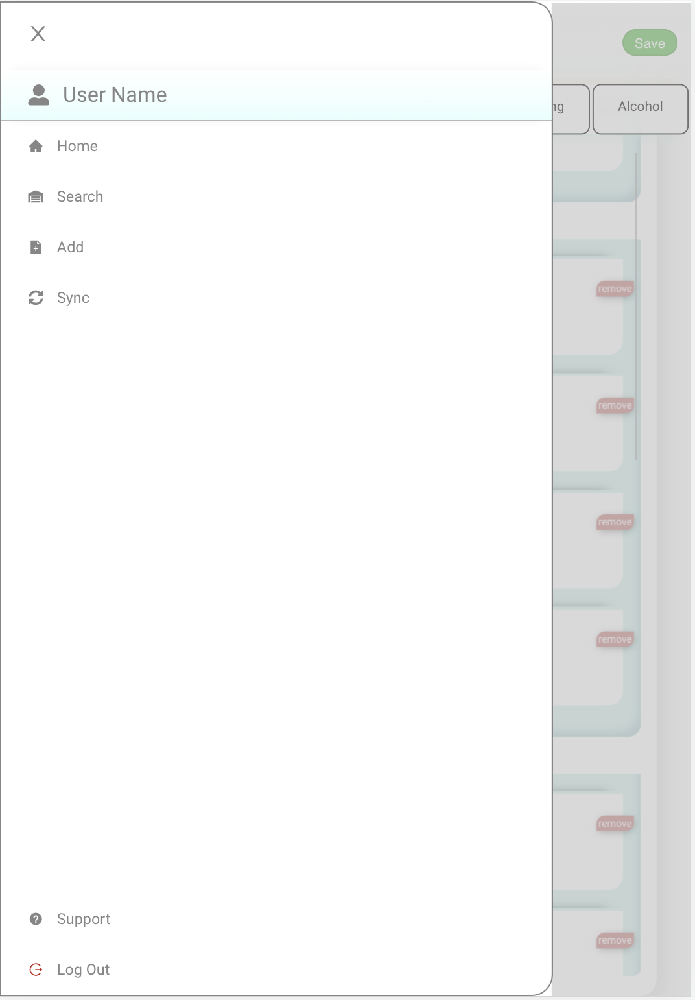
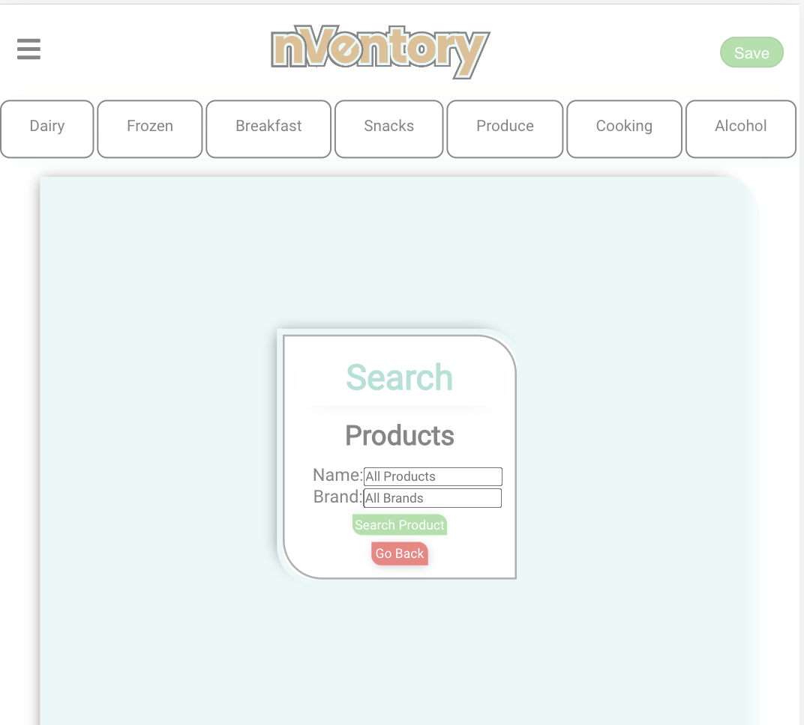
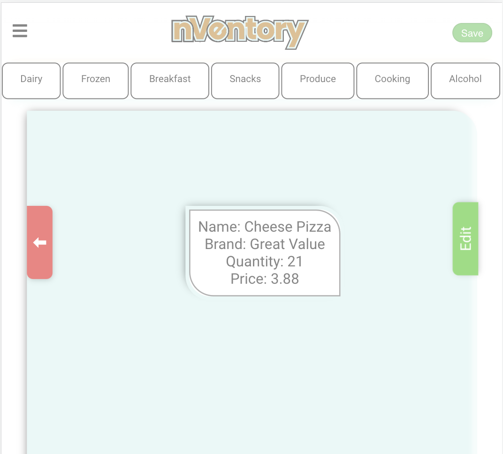
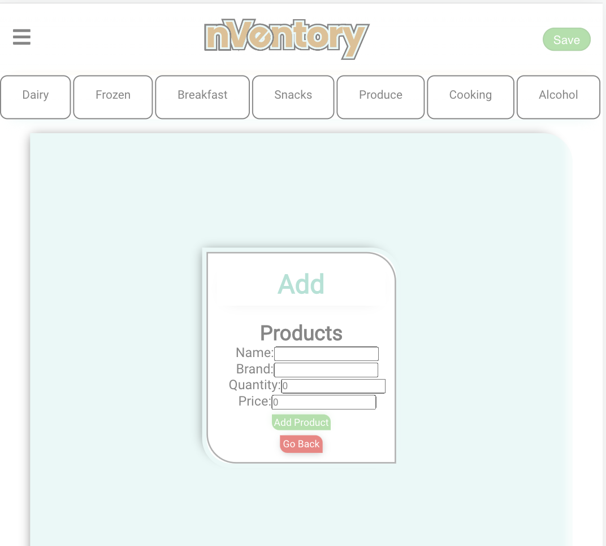

# nVentory-Frontend

The nVentory application was thought of by AJ Phoenix while working at a Shopify-based brick and mortar wine store which. The slow and sometimes distracted process of organizng the space availible inspired AJ to build a cleaner and easier system for tracking inventory.

## Link to back-end nVentory project

[nVentory back-end git repo](https://github.com/kiqueangulo/nVentory-backend)

## Link to front-end Heroku project

[nVentory front-end Deployed](https://nventory-frontend.herokuapp.com/)

# InspiringSpace

# Inital Mockup

# User Interface

 
 
 Section View

 
 
Menu Options

 
 
Product Search

 
 
Product Info

 
 
Add Product

# The technologies used to build the application

This is a PERN application.

## Frontend Built With

- [React](https://reactjs.org/) - Library Used
- [Axios](https://www.npmjs.com/package/react-axios) -Data Fetching
- [figma](https://www.figma.com/) - Mockup
- [Inkscape](https://inkscape.org/) - Logo Design
- [GitHubProjects](https://docs.github.com/en/issues/organizing-your-work-with-project-boards/managing-project-boards/about-project-boards) - Project/workflow management

## Backend Built With

- [Heroku](https://dashboard.heroku.com/apps) - Deployment Method
- [Express](https://expressjs.com/) - Web Application Framework
- [PostgreSQL](https://www.postgresql.org/) - Realational Database Management System

## Contributing

[CONTRIBUTERS](https://github.com/kiqueangulo/nVentory-frontend/graphs/contributors) Include Enrique Angulo and AJ Phoenix with reviews from Collin Blank and Jay Brewer(Backend)

## Bugs/Unfinished Goals

- CSS-styles for components and general responsiveness

+Add functionality to:

- Locations:

* Search
* Update
* Add

+Make item box quantity functional

- Would like to expand the project to be able to physically rearrange the components to fit the stores needs on the go.

- Add the syncing mechanism that checks the updated inventory initial inventory

## License

This project is licensed under the MIT License - see the [LICENSE.md](LICENSE.md) file for details
